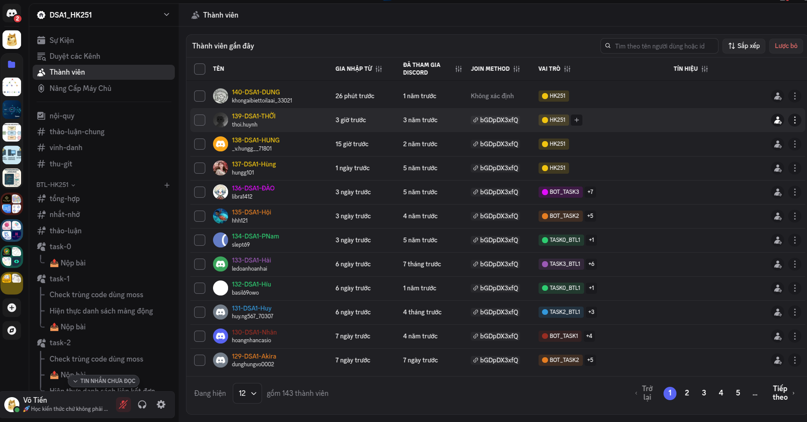

# Khóa BTL2 - DSA2 HK251 

## 🎯 Mục tiêu
- Nắm vững kiến thức về cấu trúc dữ liệu **Linked List, Array, Queue, Stack**
- Hiểu và cài đặt các giải thuật `Sort` và trên **Linked List, Array, Queue, Stack** 
- Tiếp cận các ứng dụng thực tế
- Hiện thực đồ án **BTL1**

## 📅 Lộ trình học
# 📚 Lộ trình học theo Task

## 🚀 Roadmap

- **🟢 Task 1**: Setup doctest (Ubuntu Docker, VSCode, debug C++, lệnh cơ bản)
- **🔵 Task 2**: Ôn KTLT, thiết kế DLinkedList (BTL1 HK243)
- **🟡 Task 3**: Hiện thực BTL1 HK243 (ứng dụng DLinkedList)
- **🟠 Task 4**: Thiết kế List (BTL1 HK241 & HK242), LeetCode Linked List 
- **🟣 Task 5**: Thiết kế Stack, hiện thực BTL1 HK233 & HK212 (ứng dụng JVM BTL4 PPL), LeetCode Stack
- **🟤 Task 6**: Hiện thực BTL1 HK232 (ứng dụng LinkedList trong KNN), LeetCode Queue
- **🔴 Task 7**: Hiện thực BTL1 HK211 (ứng dụng Symbol Table trong BTL3 PPL)
- **⚫ Task 8**: Page Replacement Algorithm (HĐH & KTMT)
- **Tiếp tục mở rộng ở kì sau**

## 📅 Lộ trình BTL
- 🛠️ [TASK_0_BTL1_HK251](https://github.com/DSA-HK251-Vo-Tien/TASK_0_BTL1_HK251) **Task 0**: Setup & Debug  
- 📦 [TASK_1_BTL1_HK251](https://github.com/DSA-HK251-Vo-Tien/TASK_1_BTL1_HK251) **Task 1**: Hiện thực Danh sách mảng động  
- 🔗 [TASK_2_BTL1_HK251](https://github.com/DSA-HK251-Vo-Tien/TASK_2_BTL1_HK251) **Task 2**: Hiện thực Danh sách liên kết đơn  
- 🗃️ [TASK_3_BTL1_HK251](https://github.com/DSA-HK251-Vo-Tien/TASK_3_BTL1_HK251) **Task 3**: Hiện thực Danh sách VectorStore  
- 🧮 [TASK_4_BTL1_HK251](https://github.com/DSA-HK251-Vo-Tien/TASK_4_BTL1_HK251) **Task 4**: Hiện thực Sort ứng dụng vào tìm K phần tử  
- ⚡ [TASK_5_BTL1_HK251](https://github.com/DSA-HK251-Vo-Tien/TASK_5_BTL1_HK251) **Task 5**: Hiện thực Queue Sort mô phỏng Heap (DSA2 – ứng dụng tìm K phần tử)  
- 🤖 [TASK_6_BTL1_HK251](https://github.com/DSA-HK251-Vo-Tien/TASK_6_BTL1_HK251) **Task 6**: BTL MR CNTN – ScaNN (Scalable Nearest Neighbors)

## 📖 Cách học
- Sẽ có **meeting** trong các buổi BTL để thảo luận và hướng dẫn  
- Mỗi **Task** có thể sẽ có **record** (video/ghi âm) để tham khảo lại nếu cần  
- **Discord** là nơi chính để học tập và làm việc:
  - Mỗi bạn sẽ có **2 kênh riêng** (chỉ bạn và anh thấy):  
    - 🔹 `ID-chat-Tên`: Kênh riêng để **hỏi bài, trao đổi**  
    - 🔹 `ID-bot-Tên`: Kênh riêng để **nộp bài, chạy test case, chấm kết quả**  
    - 🔹 Ngoài ra sẽ có **các kênh chung, nộp bài chung, thông báo** cho cả nhóm:  
  - **Hỏi đáp, hỗ trợ, chấm test case** sẽ thực hiện trực tiếp qua **Discord**

## 📌 Liên hệ
- 📘 Facebook Group: [Thảo luận kiến thức KHMT (CS) & KTMT (CE) trường BK](https://www.facebook.com/groups/khmt.ktmt.cse.bku)  
- 👤 Facebook cá nhân: [Shiba Võ Tiến Dạy học môn của ngành KHMT & KTMT HCMUT 4000+ Học Viên](https://www.facebook.com/Shiba.Vo.Tien)  